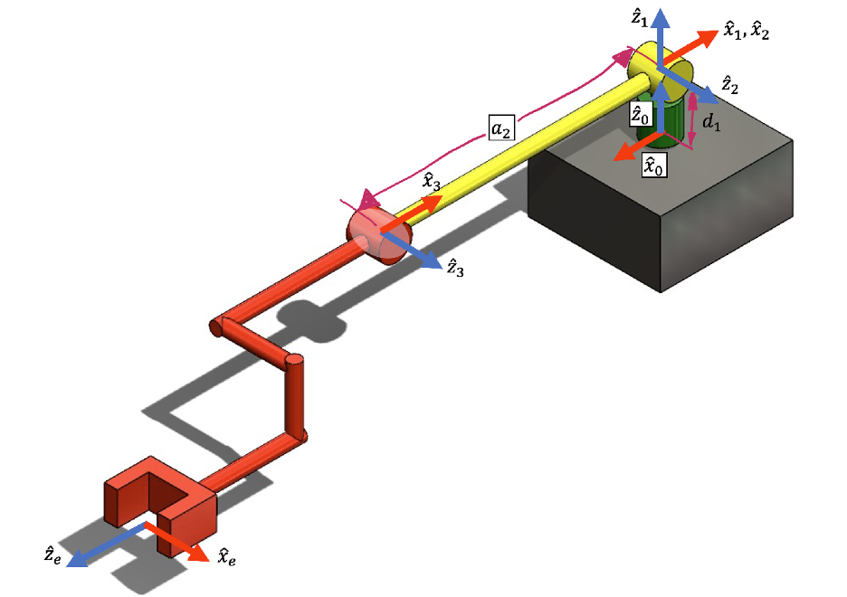
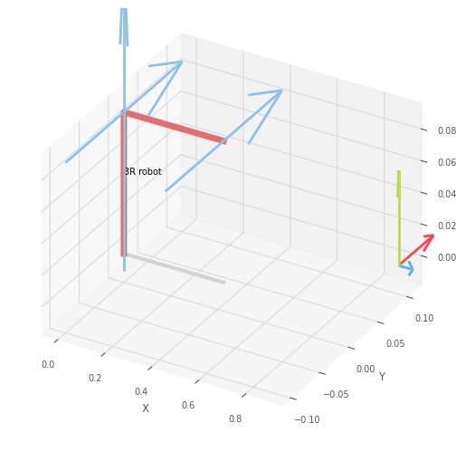

# FRA333 Homework Assignment 3: Static Force
## Objective :
This assignment is designed to allow students to apply their knowledge of differential kinematics for a 3-degree-of-freedom (3-DOF) robotic manipulator.

## RRR Robot



### Robot Modeling
The RRR robot can be modeled using the Robotics Toolbox for Python by employing Denavit-Hartenberg (DH) parameters.
```py
import roboticstoolbox as rtb
import numpy as np
from math import pi
from spatialmath import *
from HW3_utils import *
from FRA333_HW3_6537 import *

d1 = 0.0892
a2 = -0.425
T_3_e = SE3(-0.39243,-0.093,0.109) * SE3(-0.082,0,0) * SE3.RPY([0,-pi/2,0])
robot = rtb.DHRobot(
    [
        rtb.RevoluteMDH(d = d1 , offset=pi), # {1}
        rtb.RevoluteMDH(alpha=pi/2), # {2}
        rtb.RevoluteMDH(a=a2), # {3}
    ],tool = T_3_e, name="3R robot")
print(robot)
```
**Home Position of Robot**



## Question 1
Find a Jacobian matrix at end-effector frame relate to base frame

### Solution
Using a geomatric Jacobian

$$
J_{linear,i} = \hat{Z_i} \times (P_{e}^0 - P_i^0) \\
J_{angular,i} = \hat{Z_i} \\
J = \begin{bmatrix}
J_{linear} \\
J_{angular}
\end{bmatrix}
$$

```py
  def endEffectorJacobianHW3(q:list[float])->list[float]:
    R,P,R_e,p_e = FKHW3(q)      #   FK for P_0_e - P_0_i to make a Geomatric Jacobian
    J = np.empty((6,3))         #   Create Empty Matrix   
    for i in range(len(q)):
        J_v_i = np.cross(R[:,:,i][:,2],(p_e - P[:,i]))      # for linear velocity   Z cross (P_e - P_i)
        J_w_i = R[:,:,i][:,2]                               # for angular velocity  Z
        J_i = np.concatenate((J_v_i,J_w_i),axis=0)          # Concatenate the jacobian component
        J[:,i] = J_i            #   Append Jacobian of each joint
    return J
```

### Validation
Create a function that generates random joint angles and compares the Jacobian computed using the Robotics Toolbox with and my own implementation.

```py
def JacobianTest(robot):
    q1,q2,q3 = np.random.uniform(-np.pi, np.pi),np.random.uniform(-np.pi, np.pi),np.random.uniform(-np.pi, np.pi)
    q = [q1,q2,q3]                      #   Random Joint Angle
    print("Jacobian from RTB-py")
    print(robot.jacob0(q))
    print("___________________________________________\n")
    print("Jacobian from HW3")
    print(endEffectorJacobianHW3(q))
```
```py
JacobianTest(robot)     # Random Joint Angle and compare result of Jacobian matrix
```

```py
# Example of Result
Jacobian from RTB-py
[[ 3.86180993e-01 -2.61914386e-01 -1.14762756e-01]
 [-2.63347207e-01 -6.89274426e-01 -3.02018662e-01]
 [ 1.59374860e-17  4.54539889e-01  3.59648526e-01]
 [-4.62899783e-17 -9.34788037e-01 -9.34788037e-01]
 [-1.06226380e-16  3.55206033e-01  3.55206033e-01]
 [ 1.00000000e+00  6.12323400e-17  6.12323400e-17]]
___________________________________________

Jacobian from HW3
[[ 3.86180993e-01 -2.61914393e-01 -1.14762759e-01]
 [-2.63347207e-01 -6.89274435e-01 -3.02018666e-01]
 [ 0.00000000e+00  4.54539896e-01  3.59648532e-01]
 [ 0.00000000e+00 -9.34788048e-01 -9.34788048e-01]
 [ 0.00000000e+00  3.55206043e-01  3.55206043e-01]
 [ 1.00000000e+00  6.12323426e-17  6.12323426e-17]]
 ```

## Question 3
If  installs the FT300 Force Sensor, which can measure force and torque in three-dimensional coordinates, in the center of the end-effector of the RRR robot in the coordinate frame, the force values can be read from the sensor as follows:

$$
\begin{bmatrix}
moment(n^e) \\
force(f^e)
\end{bmatrix} \newline
$$

### Solution
The joint efforts of the manipulator can be calculated using equations derived from the principle of virtual work.

$$
\tau = J^TW
$$
Define :

$\tau$  is effort that effect to Manipulator $\mathbb{R}^{3 \times 1}$

$J^T$   is Transposed Jacobian of Manipulator $\mathbb{R}^{3 \times 6}$

$W$     is Wrench that action to end-effector in base frame $\mathbb{R}^{6 \times 1}$ 

```py
def computeEffortHW3(q:list[float], w:list[float])->list[float]:
    J = endEffectorJacobianHW3(q)       #   Calculate Jacobian
    R,P,R_e,p_e = FKHW3(q)              #   Get Component from FK
    f_e = w[3:]         #   Force from wrench
    n_e = w[:3]         #   Moment from wrench 
    f_0 = R_e @ f_e     # Reframe to frame 0
    n_0 = R_e @ n_e
    w_0 = np.concatenate((f_0,n_0) , axis = 0)      #   Concatenate matrix to [f_0 ; n_0]
    singularityFlag = checkSingularityHW3(q)        #   Check Singularity
    if singularityFlag == True:     # is Singularity
        return 0
    elif singularityFlag == False:  # is not Singularity
        J_transpose = np.transpose(J)   # Transpose for calculate joint effort
        tau = J_transpose @ w_0         # Calculate torque that effect to 
        return tau
```

### Validation
Create a function that generates random joint angles and wrenches to compare the joint efforts computed using the Robotics Toolbox with those obtained from my own implementation.

```py
def JointEffortTest(robot):
    q1,q2,q3 = np.random.uniform(-np.pi, np.pi),np.random.uniform(-np.pi, np.pi),np.random.uniform(-np.pi, np.pi)
    q = [q1,q2,q3]
    w = np.random.uniform(-np.pi, np.pi),np.random.uniform(-np.pi, np.pi),np.random.uniform(-np.pi, np.pi),np.random.uniform(-np.pi, np.pi),np.random.uniform(-np.pi, np.pi),np.random.uniform(-np.pi, np.pi)

    m_e = w[:3] # moment
    f_e = w[3:] # force
    w_e = np.concatenate((f_e, m_e),axis = 0)   # Concatenate to Wrench vector
    a = robot.pay(W= w_e , q = q,frame=1)       # Calculating Joint Effort from RTB-py
    b = computeEffortHW3(q,w)                   # Calculating Joint Effort from HW3
    print(f"Joint Effort RTB : {a}")
    print(f"Joint Effort HW3 : {b}")
```
```py
JointEffortTest(robot)
```
```py
# Example of Result
Joint Effort RTB : [1.04711584 0.21473435 0.54416665]
Joint Effort HW3 : [-1.04711574 -0.21473435 -0.54416664]
```

Joint Effort RTB 
- Refers to the torque required by the manipulator to counteract the external force applied at the end-effector.

Joint Effort HW3 
- Refers to the torque generated by the external force acting on the manipulator.

RTB and HW3 is calculate from different perspective torque that action to end-effector